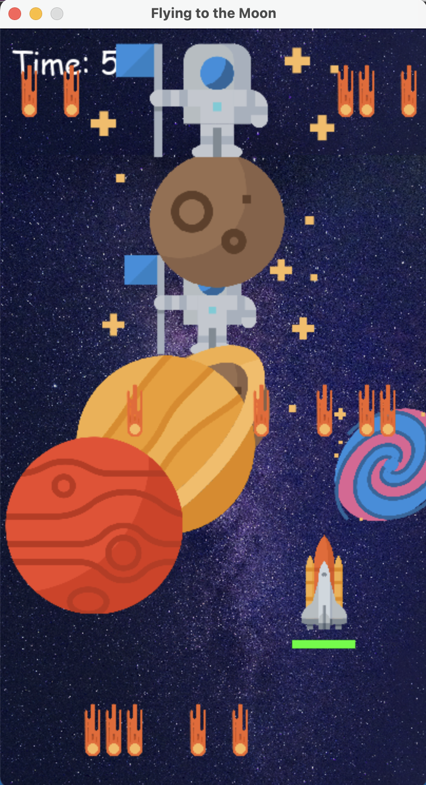

<div align="center">
  
  <h1 align="center">Pygame Dodger Project</h1>

  <p align="center">
    A project using mainly pygame module to create a space dodging game. The player will control the spaceship to avoid falling stars in a limited range, while appreciating the beauty of the space.
    <br />
    
  </p>
</div>

## Description
"Flying to the Moon" is a 2D computer game developed using Python and the Pygame library. The player controls a spaceship navigating through space, avoiding falling stars and c. The game increases in difficulty over time, challenging players to survive as long as possible.
For now, the way to play is simple: you dodge the stars until you don't. 
Future changes I want to add on:
* Reduce background glitches while scrolling.
* Destination point on the moon after a long ride.
* Magical items that boost the spaceship in various ways.
* Best score shown at the main menu.
* Skins for the spaceship.


## How to Play
- Have Python installed on your machine.
- Run the script:
  ```sh
  python flying_to_the_moon.py
  ```
- Player can control the spaceship's direction by pressing the arrow keys or the WASD keys.
- The spaceship is only allowed to move within the bottom part of the screen.
- Dodge the falling stars. Be careful! The amount of stars and the speed of falling are increasing overtime.
- The planets passing by are just there for, well, appreciation. Make sure to not get distracted by them!
- Enjoy the space journey!


## Dependencies
* Python 3.x 
* pygame, random, time, sys packages

## Contact
Mujie Shen - [GitHub](https://github.com/Muji8226) - [LinkedIn](http://www.linkedin.com/in/mujie-shen/)

## Acknowledgement
- This project was created to demonstrate the use of Python for game development and to put programming skills into practice. Many helps were received through various online resources during its development. Below are the main references that provided me with great technical support:
* Coding with Russ, YouTube. [https://www.youtube.com/@CodingWithRuss]
* Stack Overflow. [https://stackoverflow.com/]
* Hover Button in Pygame, GeeksforGeeks. [https://www.geeksforgeeks.org/hover-button-in-pygame/]
* HOW TO MAKE A MENU SCREEN IN PYGAME! baraltech, YouTube. [https://www.youtube.com/watch?v=GMBqjxcKogA]
* [Img Shields](https://shields.io)

